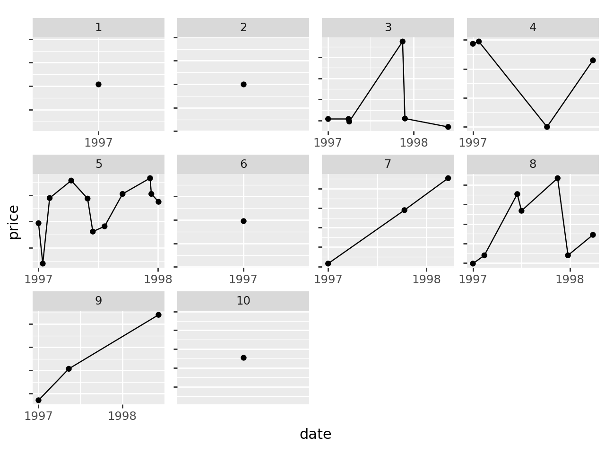

# Customer Lifetime Value & RFM Analysis

#### What is Customer Lifetime Value (CLV)?
Customer lifetime value or CLV is a forecast over a period of time of a customer’s monetary value to the company after considering the association with the customer. Customer lifetime value helps in understanding the profits that a company would make from a customer’s in his or her association over a time period.

#### Customer Purchase Patterns

